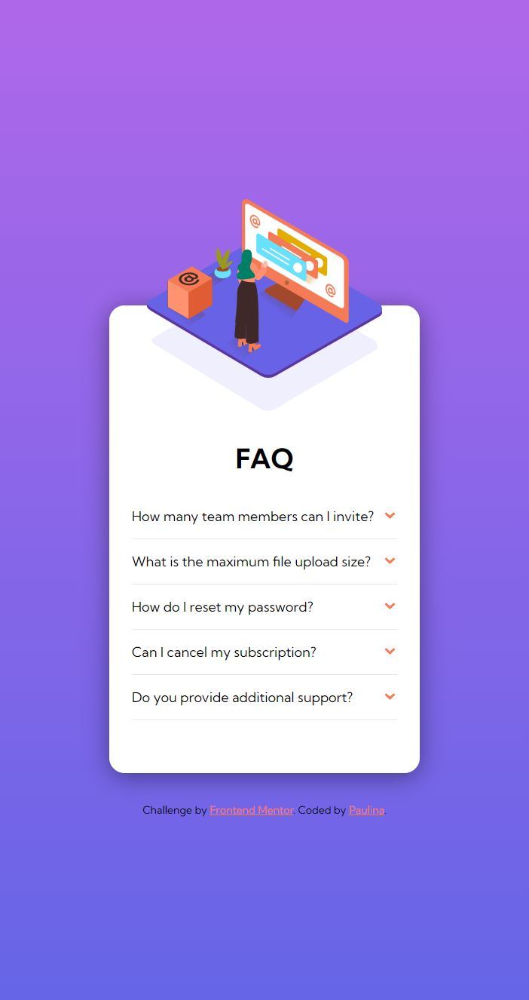
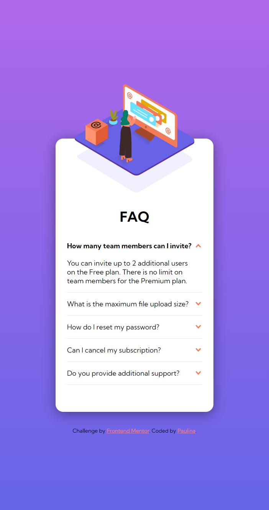
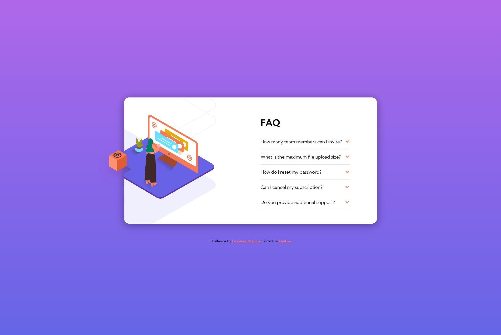

# Frontend Mentor - FAQ accordion card solution

This is a solution to the [FAQ accordion card challenge on Frontend Mentor](https://www.frontendmentor.io/challenges/faq-accordion-card-XlyjD0Oam).

## Table of contents

- [Overview](#overview)
  - [The challenge](#the-challenge)
  - [Screenshot](#screenshot)
  - [Link](#link)
- [My process](#my-process)
  - [Design](#design)
  - [Development](#development)
  - [Built with](#built-with)
  - [What I learned](#what-i-learned)

## Overview

This project is a simple FAQ (Frequently Asked Questions) section with interactive functionalities. It includes a nice visual illustration and the ability to reveal and hide answers to the FAQs when users click on the questions. The layout is responsive and changes according to the screen size.

### The challenge

Users should be able to:

- View the optimal layout for the component depending on their device's screen size
- See hover states for all interactive elements on the page
- Hide/Show the answer to a question when the question is clicked

### Screenshot

### Link

- Live Site URL: (https://incomparable-genie-9b38db.netlify.app/)

## My process

### Design
I was provided with a design for this project from Frontend Mentor. The design was clear and user-friendly. I had to recreate this design and bring it to life using HTML, CSS, and JavaScript.

### Development

The layout was achieved with Flexbox for general structure and Grid for the FAQ layout. I used JavaScript to add interactivity to the FAQ section, enabling the reveal and hide functionality for the answers.

The website is fully responsive. It maintains a single-column layout on mobile screens for better readability, and shifts to a multi-column layout on larger screens for better utilization of space.

### Built with

- Semantic HTML5 markup
- CSS custom properties
- Flexbox
- CSS Grid
- JavaScript
- Mobile-first workflow
- Responsive Design

### What I learned

This project helped reinforce my understanding of CSS layout models and responsive design. I practiced using Flexbox and Grid to create a layout that adjusts to different screen sizes.

I encountered some challenges with CSS background images and positioning, which gave me the chance to explore different possible solutions. Although not all solutions worked as expected, the process helped me gain a better understanding of how CSS positioning and backgrounds work.
